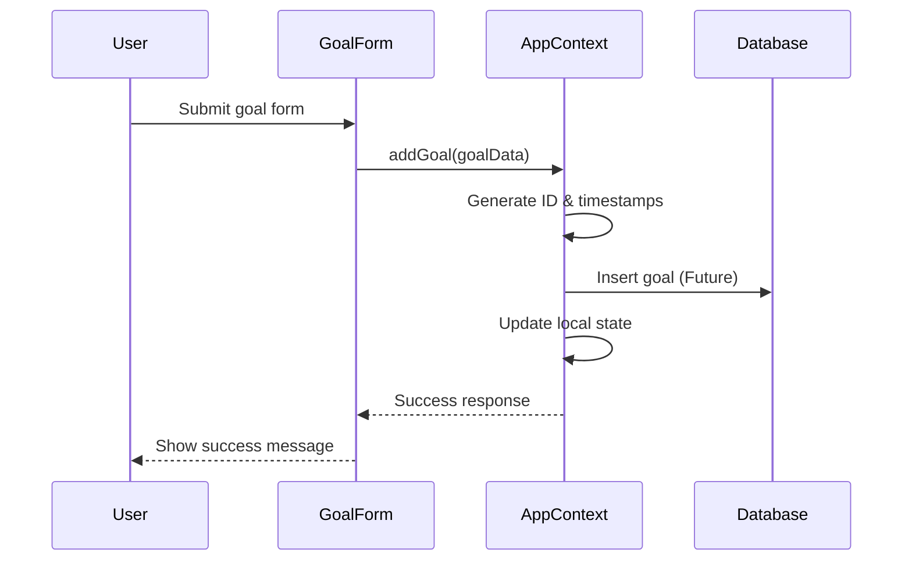
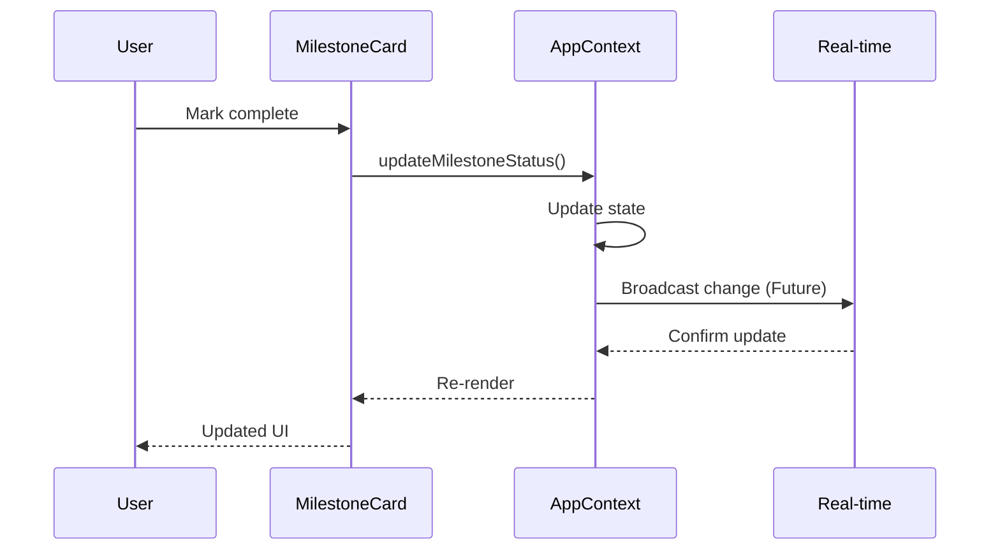

# API Reference

This document covers the API endpoints, data operations, and integration patterns for AccountaPod MVP.

## Overview

AccountaPod currently uses a hybrid approach:
- **Authentication**: Supabase Auth API
- **Data Operations**: Mock data with local state management
- **Real-time**: Supabase real-time listeners for auth state

## Authentication API

### Supabase Auth Integration

All authentication flows through Supabase's built-in authentication service.

#### Sign In

```typescript
// POST (via Supabase SDK)
const { data, error } = await supabase.auth.signInWithPassword({
  email: string,
  password: string
});

// Response
{
  data: {
    user: User | null,
    session: Session | null
  },
  error: AuthError | null
}
```

**Example Request**:
```javascript
const response = await supabase.auth.signInWithPassword({
  email: "alex@example.com",
  password: "securepassword123"
});
```

#### Sign Up

```typescript
// POST (via Supabase SDK)
const { data, error } = await supabase.auth.signUp({
  email: string,
  password: string,
  options?: {
    data: { name: string }
  }
});
```

#### Sign Out

```typescript
// POST (via Supabase SDK)
const { error } = await supabase.auth.signOut();
```

#### Get Session

```typescript
// GET (via Supabase SDK)
const { data: { session } } = await supabase.auth.getSession();
```

#### Auth State Listener

```typescript
const { data: { subscription } } = supabase.auth.onAuthStateChange(
  (event, session) => {
    // Handle auth state changes
    console.log(event, session);
  }
);
```

## Data Operations API

Currently implemented through Context API with mock data. Future implementation will use Supabase database operations.

### Goals API

#### Get User Goals

```typescript
// Current Implementation (Mock)
const { goals } = useApp();
const userGoals = goals.filter(goal => goal.userId === currentUser.id);

// Future Implementation (Supabase)
const { data, error } = await supabase
  .from('goals')
  .select('*')
  .eq('user_id', userId);
```

#### Create Goal

```typescript
// Current Implementation
const { addGoal } = useApp();
addGoal({
  userId: string,
  podId: string,
  title: string,
  description: string,
  type: 'life' | 'work',
  quarter: string
});

// Future Implementation
const { data, error } = await supabase
  .from('goals')
  .insert([{
    user_id: userId,
    pod_id: podId,
    title,
    description,
    type,
    quarter
  }]);
```

#### Update Goal Progress

```typescript
// Current Implementation
const { updateGoalProgress } = useApp();
updateGoalProgress(goalId: string, progress: number);

// Future Implementation
const { data, error } = await supabase
  .from('goals')
  .update({ progress })
  .eq('id', goalId);
```

### Milestones API

#### Get Goal Milestones

```typescript
// Current Implementation
const { milestones } = useApp();
const goalMilestones = milestones.filter(m => m.goalId === goalId);

// Future Implementation
const { data, error } = await supabase
  .from('milestones')
  .select('*')
  .eq('goal_id', goalId)
  .order('week_number', { ascending: true });
```

#### Create Milestone

```typescript
// Current Implementation
const { addMilestone } = useApp();
addMilestone({
  goalId: string,
  title: string,
  description: string,
  weekNumber: number
});

// Future Implementation
const { data, error } = await supabase
  .from('milestones')
  .insert([{
    goal_id: goalId,
    title,
    description,
    week_number: weekNumber
  }]);
```

#### Update Milestone Status

```typescript
// Current Implementation
const { updateMilestoneStatus } = useApp();
updateMilestoneStatus(
  milestoneId: string, 
  status: 'not-started' | 'in-progress' | 'completed',
  completedAt?: string
);

// Future Implementation
const { data, error } = await supabase
  .from('milestones')
  .update({ 
    status, 
    completed_at: completedAt 
  })
  .eq('id', milestoneId);
```

### Pods API

#### Get User Pods

```typescript
// Current Implementation
const { pods, currentUser } = useApp();
const userPods = pods.filter(pod => 
  pod.members.some(member => member.id === currentUser.id)
);

// Future Implementation
const { data, error } = await supabase
  .from('pod_members')
  .select(`
    pod_id,
    pods (*)
  `)
  .eq('user_id', userId);
```

#### Update Pod Settings

```typescript
// Current Implementation
const { updatePodSettings } = useApp();
updatePodSettings(podId: string, settings: PodSettings);

// Future Implementation
const { data, error } = await supabase
  .from('pods')
  .update({ settings })
  .eq('id', podId);
```

### Check-ins API

#### Get Weekly Check-ins

```typescript
// Current Implementation
const { checkIns } = useApp();
const weekCheckIns = checkIns.filter(
  checkin => checkin.weekNumber === weekNumber
);

// Future Implementation
const { data, error } = await supabase
  .from('checkins')
  .select('*')
  .eq('pod_id', podId)
  .eq('week_number', weekNumber)
  .order('created_at', { ascending: false });
```

## Data Flow Diagrams

### Goal Creation Flow



### Milestone Progress Flow



## Mock Data Structure

### Available Test Data

The application includes comprehensive mock data for development:

**Users** (`src/data/mockData.ts`):
```typescript
{
  id: '1',
  name: 'Alex Johnson',
  email: 'alex@example.com',
  avatarUrl: 'https://...',
  createdAt: '2025-01-01T00:00:00Z'
}
```

**Pods**:
```typescript
{
  id: '1',
  name: 'Growth Hackers',
  description: 'A group focused on personal and professional growth',
  members: [/* User objects */],
  ownerId: '1',
  settings: { weekStartDay: 1 }
}
```

**Goals**:
```typescript
{
  id: '1',
  userId: '1',
  podId: '1',
  title: 'Run a half marathon',
  description: 'Train and complete a half marathon by the end of the quarter',
  type: 'life',
  quarter: 'Q2 2025',
  progress: 35
}
```

## Error Handling

### Authentication Errors

```typescript
try {
  const { data, error } = await supabase.auth.signInWithPassword({
    email,
    password
  });
  
  if (error) {
    // Handle specific error types
    switch (error.message) {
      case 'Invalid login credentials':
        setError('Invalid email or password');
        break;
      case 'Email not confirmed':
        setError('Please check your email and confirm your account');
        break;
      default:
        setError('Failed to sign in');
    }
  }
} catch (err) {
  console.error('Auth error:', err);
  setError('Network error. Please try again.');
}
```

### Data Operation Errors

```typescript
// Current mock implementation includes error simulation
const addGoal = async (goalData) => {
  try {
    // Simulate API delay
    await new Promise(resolve => setTimeout(resolve, 500));
    
    // Validate required fields
    if (!goalData.title || !goalData.description) {
      throw new Error('Title and description are required');
    }
    
    // Add to state
    setGoals(prev => [...prev, newGoal]);
  } catch (error) {
    console.error('Failed to add goal:', error);
    throw error;
  }
};
```

## Rate Limiting & Performance

### Current Limitations

- Mock data operations are instant (no network delay)
- No rate limiting implemented
- Local state management only

### Future Considerations

- Supabase rate limiting: 100 requests per second per API key
- Real-time connections: 100 concurrent connections
- Database row-level security policies
- Optimistic updates for better UX

## Integration Examples

### Complete Goal Management Workflow

```typescript
const GoalWorkflow = () => {
  const { addGoal, addMilestone, updateMilestoneStatus } = useApp();
  
  // 1. Create a goal
  const createGoal = async () => {
    const goal = await addGoal({
      userId: currentUser.id,
      podId: currentPod.id,
      title: "Complete certification",
      description: "Pass the professional certification exam",
      type: "work",
      quarter: "Q2 2025"
    });
    
    // 2. Add milestones
    const milestones = [
      { title: "Study chapters 1-3", weekNumber: 1 },
      { title: "Take practice exam", weekNumber: 2 },
      { title: "Review weak areas", weekNumber: 3 }
    ];
    
    for (const milestone of milestones) {
      await addMilestone({
        goalId: goal.id,
        ...milestone
      });
    }
  };
  
  // 3. Track progress
  const completeWeek = async (milestoneId: string) => {
    await updateMilestoneStatus(
      milestoneId, 
      'completed', 
      new Date().toISOString()
    );
  };
};
```

## Future API Endpoints

When moving from mock data to full implementation:

### Planned Endpoints

```
POST   /api/goals                 # Create goal
GET    /api/goals                 # List user goals
PUT    /api/goals/:id             # Update goal
DELETE /api/goals/:id             # Delete goal

POST   /api/milestones            # Create milestone
GET    /api/milestones            # List milestones
PUT    /api/milestones/:id        # Update milestone

POST   /api/checkins              # Submit check-in
GET    /api/checkins              # Get check-ins

POST   /api/pods                  # Create pod
GET    /api/pods                  # List user pods
POST   /api/pods/:id/join         # Join pod
```

For implementation details and current limitations, see [Architecture](ARCHITECTURE.md) and [Limitations](LIMITATIONS.md).
