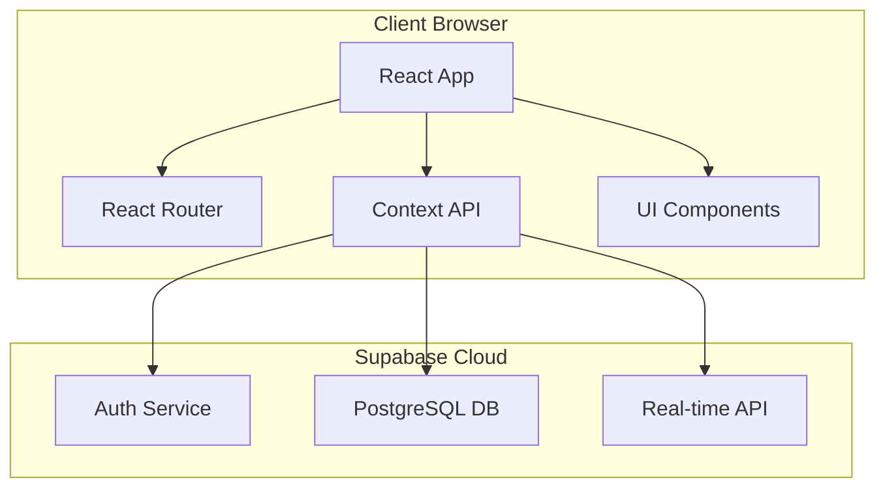
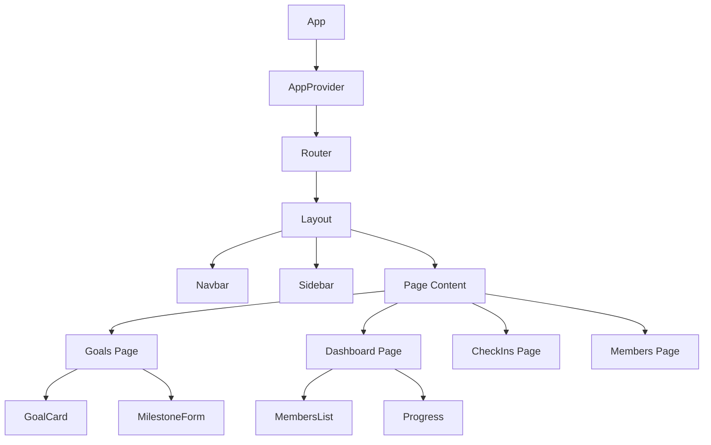
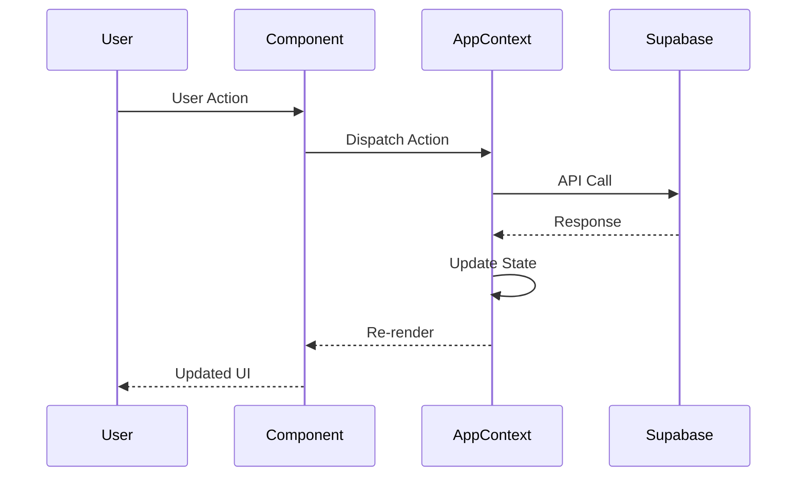
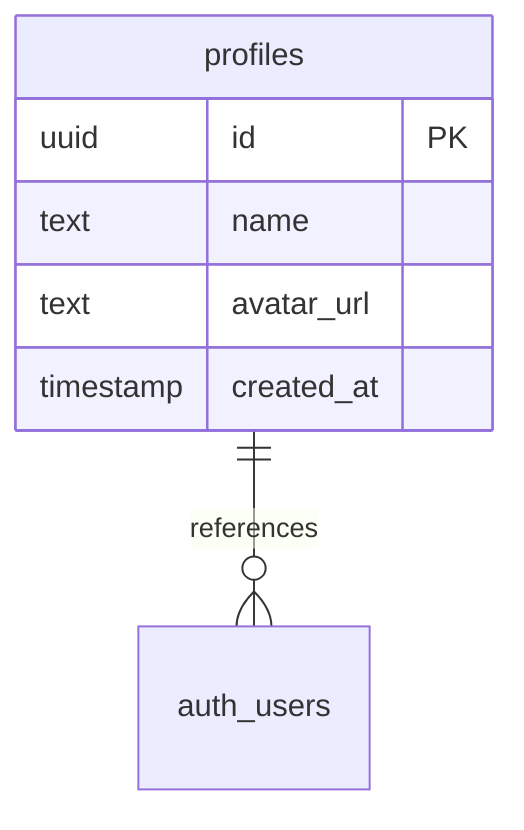
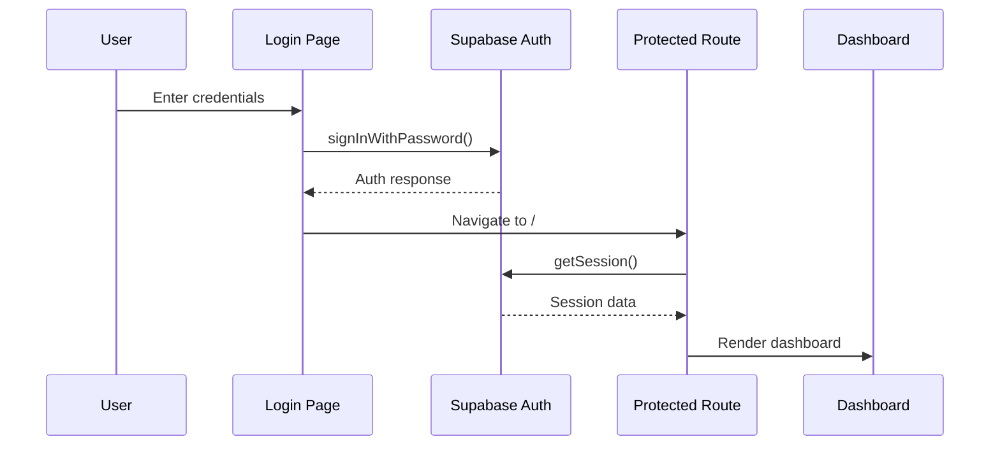
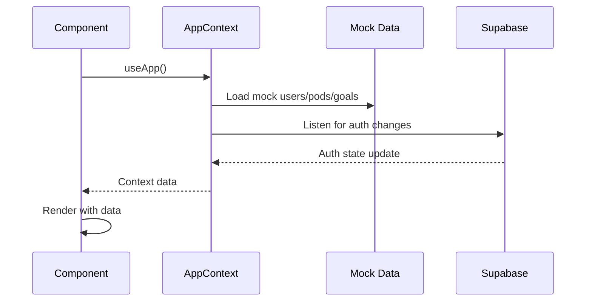
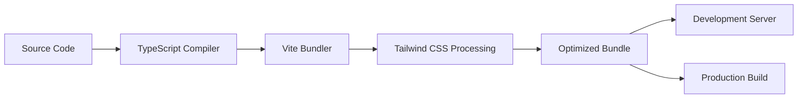

# Architecture Guide

This document outlines the system architecture, codebase structure, and data flow patterns for AccountaPod MVP.

## System Overview

AccountaPod follows a modern single-page application (SPA) architecture with a React frontend and Supabase backend-as-a-service.



## Frontend Architecture

### Core Technologies

- **React 18**: Component-based UI library with hooks
- **TypeScript**: Type-safe JavaScript development
- **Tailwind CSS**: Utility-first CSS framework
- **Vite**: Fast build tool and development server
- **React Router v6**: Client-side routing

### Directory Structure

```
src/
├── components/          # Reusable UI components
│   ├── auth/           # Authentication components
│   ├── dashboard/      # Dashboard-specific components
│   ├── forms/          # Form components
│   ├── layout/         # Layout components
│   └── ui/             # Base UI components
├── context/            # React Context providers
├── data/               # Mock data and constants
├── lib/                # External service integrations
├── pages/              # Route-level page components
├── styles/             # Global styles and animations
├── types/              # TypeScript type definitions
└── utils/              # Utility functions
```

### Component Architecture



## Data Management

### State Architecture

The application uses React Context API for global state management:

**AppContext** (`src/context/AppContext.tsx`):
- Current user authentication state
- Pod membership and settings
- Goals, milestones, and check-ins data
- CRUD operations for all entities

### Data Flow



### Data Models

**Core Types** (`src/types/index.ts`):

```typescript
interface User {
  id: string;
  name: string;
  email: string;
  avatarUrl: string;
  createdAt: string;
}

interface Pod {
  id: string;
  name: string;
  description: string;
  members: User[];
  ownerId: string;
  settings: PodSettings;
}

interface Goal {
  id: string;
  userId: string;
  podId: string;
  title: string;
  description: string;
  type: 'life' | 'work';
  quarter: string;
  progress: number; // 0-100
}

interface Milestone {
  id: string;
  goalId: string;
  title: string;
  weekNumber: number;
  status: 'not-started' | 'in-progress' | 'completed';
}
```

## Backend Architecture

### Supabase Services

**Authentication**: 
- Email/password authentication
- Session management
- Protected routes via `ProtectedRoute` component

**Database**: 
- PostgreSQL with Row Level Security (RLS)
- Currently minimal schema (profiles table only)
- Mock data used for development

**Real-time**: 
- WebSocket connections for live updates
- Auth state change listeners

### Database Schema



**Note**: Full schema implementation is pending. Currently using mock data.

## Request Flow

### Authentication Flow



### Data Loading Flow



## Security Architecture

### Authentication Security

- Supabase handles secure session management
- JWT tokens for API authentication
- Automatic token refresh
- Session persistence across browser refreshes

### Route Protection

```typescript
// Protected route implementation
const ProtectedRoute = ({ children }) => {
  useEffect(() => {
    const checkAuth = async () => {
      const { data: { session } } = await supabase.auth.getSession();
      if (!session) navigate('/login');
    };
    checkAuth();
  }, []);
  
  return <>{children}</>;
};
```

### Data Access Patterns

- Context-based data access
- Type-safe API interactions
- Error boundaries for graceful failures

## Performance Considerations

### Bundle Optimization

- Vite for fast HMR and builds
- Code splitting at route level
- Tree shaking for unused code elimination
- Lucide icons excluded from optimization for better performance

### Runtime Performance

- React 18 concurrent features
- Component memoization where needed
- Efficient re-rendering via Context optimization
- Mock data for development performance

## Development Architecture

### Build Pipeline



### Development Tools

- **ESLint**: Code quality and consistency
- **TypeScript**: Type checking and IntelliSense
- **Tailwind**: Utility-first styling
- **Vite**: Fast development server
- **React DevTools**: Component debugging

## Deployment Architecture

### Build Process

```bash
npm run build  # Vite production build
npm run preview  # Local production preview
```

### Production Considerations

- Static file hosting (Vercel, Netlify, etc.)
- Environment variable management
- Supabase edge functions for API extensions
- CDN for static assets

## Future Architecture Considerations

### Scalability

- Move from mock data to full Supabase schema
- Implement proper database relationships
- Add real-time synchronization
- Optimize for larger pod sizes

### Feature Extensions

- File uploads for goal attachments
- Email notifications via Supabase Edge Functions
- Mobile app via React Native
- Analytics dashboard with charting library

See [Limitations](LIMITATIONS.md) for current architectural constraints and [API Reference](API_REFERENCE.md) for implementation details.
